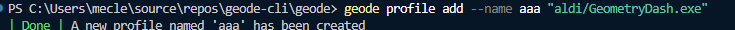
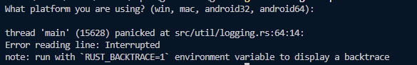
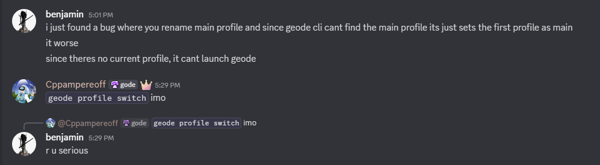

> [!WARNING]
> **THIS CLI IS IN VERY VERY ALPHA!!!**

# geode cli (java port)

or how hiimjasmine000 say:

basically, its a [geode cli](https://github.com/geode-sdk/cli) with some features like:

- less dependencies than original (im not compile allat)
- non crashing mod.json replacements
- doesnt have stupid decisions like [this](https://github.com/geode-sdk/cli/pull/147)
- offline templates
- (almost) fully compatible with original cli
- and some other cool features

and yes, it doesnt run on macos

## faq

**first question:**

because original cli is broken asf, look

and something like this:

**next question:**

no, but you can send pull request where every file deleted or make a fork and delete everything

**third question**:

"cli looks awesome, can i make an amazing pull request that wont be accepted for 8 months?" - yes, you can