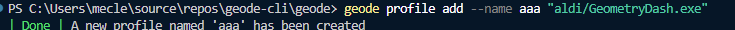
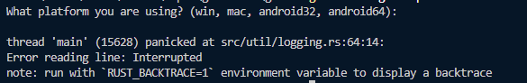
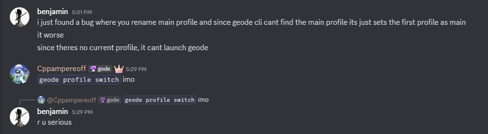

> [!WARNING]
> **THIS CLI IS IN VERY ALPHA!!!**

# geode cli (java port)

or how hiimjasmine000 say:


basically, its a [geode cli](https://github.com/geode-sdk/cli) with some features like:

- not rust
- less dependencies than original (im not compile all 388)
- non crashing mod.json replacements
- doesnt have stupid decisions like [this](https://github.com/geode-sdk/cli/pull/147)
- offline templates
- (almost) fully compatible with original cli
- loading animations
- cache
- and some other cool features

> [!NOTE]
> NOT tested on MacOS

## build

easy, look

```bash
mvn clean package # ensure you have maven installed
```

you will get a 5mb jar

if you want .exe:

```bash
mvn clean package -Pnative # ensure you have maven and native-image installed
```

.exe is 35mb

## faq

**Q:** "yo, i dont want to copy+paste imports and other stuff for new command, is there any solution?"

**A:** yes, [right here](https://github.com/benjamin538/commandgen)

**Q:** "i want to contribute! can i make an pull request / open issue"

**A:** ofc you can, i will be very happy

now to my favorite questions

**Q:**


**A:** because original cli is broken asf, look





and something like this:


**Q:**


**A:** no, but you can send pull request where every file deleted or make a fork and delete everything